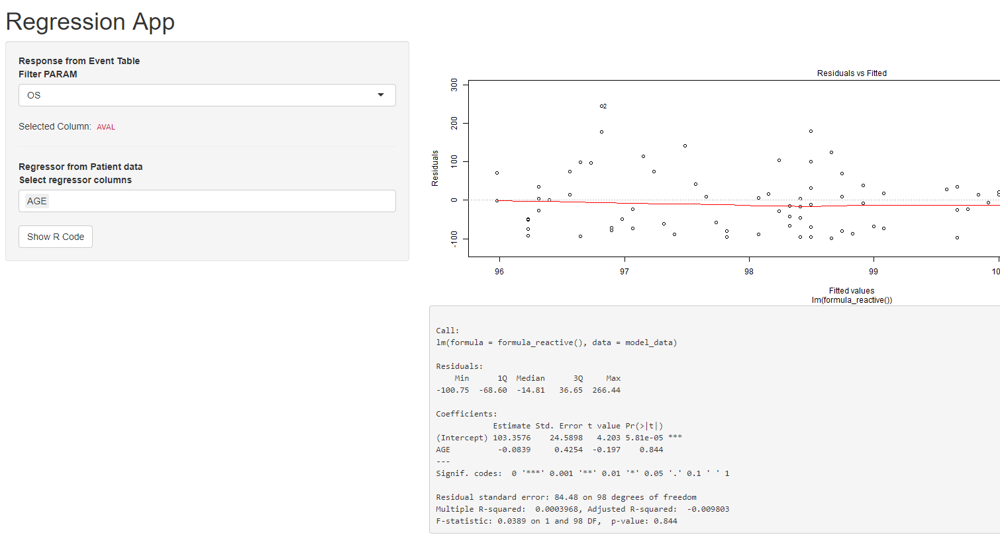

# shinymeta - my first try

Trying a multi output shiny app with reproducibility by [shinymeta](https://github.com/rstudio/shinymeta)

## App example

This repo contains two apps that try using the new [shinymeta](https://github.com/rstudio/shinymeta) package. The apps basically

1. `Filter` one data set (`event_data`)
2. `Select` a second data set (`pat_data`)
3. Merge the two data sets on keys
4. Create a linear model from measurements in `event_data` vs selected columns in `pat_data`
5. Plot the linear model
6. Show the summary of the linear model
7. Make it reproducible by a "Show R Code" button



## Installation

get shinymeta from github by

```r
devtools::install_github("rstudio/shinymeta")
```

## Why reproducibility?

The example shown here is a typical analysis in clinical studies. Though the data is totally randomized.

For the clinical study the biostatistician wants to see different plots for different events. He wants
to take the one with the highest impact into the
study report. This study report will be send to authorities like [**FDA**](https://en.wikipedia.org/wiki/Food_and_Drug_Administration). The **FDA** would like to see how
the plot was produced and which data went in. The reproducibility feature would allow the **FDA**
to create the plot themselves by having the app or the report + code.

## Why 2 apps?

`app.R` contains an app that just uses `metaReactive`s like shown in the example by
[`shinymeta`](https://github.com/rstudio/shinymeta). I basically tried to put everything in. This app
though produces some ugly code

```r
formula_reactive <- stats::as.formula(paste("AVAL", paste("AGE", collapse = " + "), sep = " ~ "))
```

I just wanted to see the outcome of this in my reproducible code. So e.g. `AVAL ~ AGE`. Therefore I tried to use
a standard `shiny::reactive` instead of a `metaReactive` in the second app `app_mixed_reactives.R`:

```r
formula_reactive <- reactive({
    validate(need(is.character(input$select_regressor), "Cannot work without selected column"))

    stats::as.formula(paste("AVAL", paste(input$select_regressor, collapse = " + "), sep = " ~ "))
  })

  # Create a linear model
  model_reactive <- metaReactive2({
    validate(need(is.data.frame(data_set_reactive()), "Data Set could not be created"))
    validate(need(is.language(formula_reactive()), "Formula could not be created from column selections"))

    metaExpr({
      model_data <- !!data_set_reactive()
      lm(formula = !!formula_reactive(), data = model_data)
    })
  })
```

**surprisingly**  it worked

## Acknowledgements

My current project is in the team Adrian Waddell (@waddella). He was inspiring the over-overarching metaprogramming approach in shinymeta. This encouraged me to try out `shinymeta`.
